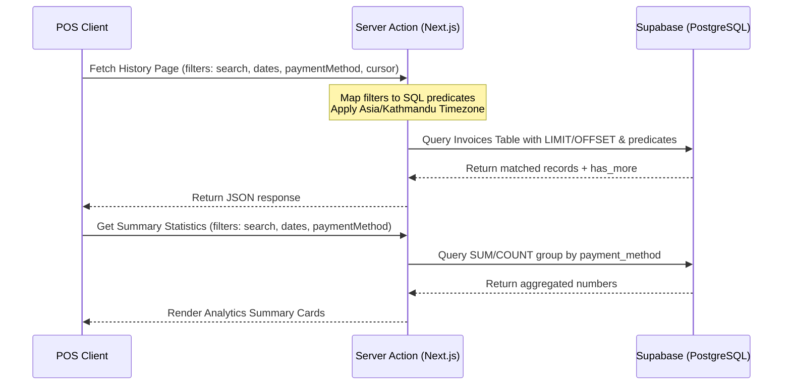

# 📊 PaisaPOS Dashboard Audit Report

## 1. Executive Summary

A comprehensive static code analysis and architectural audit was performed on the **PaisaPOS Dashboard** feature. The audit focused on timezone/date processing, data querying constraints, UI rendering efficiency, state hydration/synchronization, and empty state boundaries.

### Key Metrics

- **Overall Code Quality Score:** `5.5 / 10`
- **Critical Issues Found:** `2` (Incorrect Today's Sales metrics under load; Initial state loading race condition)
- **High/Medium Issues Found:** `3` (Timezone hydration mismatch; Quadratic time complexity in warning panel; Missing memoization / GC pressure)
- **Low/UX Issues Found:** `2` (Hardcoded fallbacks during store loading; Missing dashboard-level skeleton loader)

### High-Level Summary

While the dashboard features clean TypeScript typings and a modular layout, it suffers from several structural flaws. Most notably, **Today's Sales** is computed on the client side using a Zustand store slice that is capped at 50 invoices. If the store handles more than 50 sales in a day, the metrics will under-report revenue. Additionally, a race condition during authentication session initialization causes a visible flash of empty states on every page load. Fixing these issues will significantly improve correctness, performance, and the premium visual feel of the dashboard.

---

## 2. Detailed Findings

### [Severity: Critical] — Today's Sales Under-Reporting due to Pagination & Fetch Limits

- **Location:** [auth-slice.ts](file:///c:/nooridigital_assets/my-projects/billing-system-26-5-21/src/features/auth/state/auth-slice.ts#L447-L452)
- **Description:** The dashboard's "Today's Sales" and "Today's Transactions" metrics are computed entirely client-side using `invoices` array in the Zustand store. However, on initial load, `fetchStoreData` queries invoices with a flat limit of 50.
- **Root Cause:**
  ```typescript
  supabase
    .from("invoices")
    .select(...)
    .eq("store_id", store.id)
    .order("created_at", { ascending: false })
    .limit(50) // <-- Hardcoded cap
  ```
- **Impact:** If a store processes more than 50 sales in a single day, the invoices beyond the 50th will not be fetched in the initial state load. As a result, the client-side `buildDashboardMetrics` calculation will under-report "Today's Sales" sum and transaction counts.
- **Recommended Fix:**
  Either (a) fetch dashboard metrics directly via a database aggregation RPC (recommended for scalability), or (b) adjust the fetch logic to query all invoices created today, plus a baseline number of historical invoices:

  ```typescript
  // Option A (Best practice): Add database RPC or direct aggregation query:
  const todayStart = new Date();
  todayStart.setHours(0, 0, 0, 0);

  const [productsResult, variantsResult, invoicesResult, todayMetricsResult] =
    await Promise.all([
      // ... products & variants queries
      supabase
        .from("invoices")
        .select("id, created_at, total_amount")
        .eq("store_id", store.id)
        .order("created_at", { ascending: false })
        .limit(50),
      // Query sum and count for today
      supabase.rpc("get_store_daily_sales", {
        p_store_id: store.id,
        p_start_date: todayStart.toISOString(),
      }),
    ]);
  ```

---

### [Severity: Critical] — State Synchronization Race Condition causing UI/Empty-State Flicker

- **Location:** [auth-slice.ts](file:///c:/nooridigital_assets/my-projects/billing-system-26-5-21/src/features/auth/state/auth-slice.ts#L294-L316)
- **Description:** On application load, `initializeSession` sets `user` and `store` in the state before it fetches the store's products, variants, and invoices.
- **Root Cause:**

  ```typescript
  // 1. Sets user/store (marks as authenticated)
  set({
    user: { ... },
    store: { ... },
    activeDelegations,
    sessionStatus: "authenticated",
  });

  subscribeToRealtimeChanges(...);

  // 2. Only now does it await the actual data fetch
  await get().fetchStoreData();
  ```

- **Impact:** In `authenticated-shell.tsx`, the loader checks `if (isLoading && !user)`. The moment `user` is set, this condition becomes `false`, hiding the full-screen loader. The dashboard page immediately mounts and renders with empty arrays in the store, displaying false empty states ("No invoices generated yet", "All Stock Healthy", default "KTM Boutique"). Once `fetchStoreData` completes, the UI suddenly flashes and redraws with the real data.
- **Recommended Fix:**
  Keep `isLoading` true and do not set `user` / `store` in Zustand until `fetchStoreData` completes. Perform the state update atomically:

  ```typescript
  // Inside initializeSession:
  const profileStoreId = profile.store_id;
  const activeDelegations = await loadActiveDelegations({ ...profile, store_id: profileStoreId });

  // 1. Fetch store data first in the background
  const [productsData, variantsData, invoicesData] = await fetchInitialStoreData(profileStoreId);

  // 2. Set authenticated state AND loaded collections atomically
  set({
    user: { ... },
    store: { ... },
    products: productsData,
    variants: variantsData,
    invoices: invoicesData,
    activeDelegations,
    sessionStatus: "authenticated",
    isLoading: false, // Turn off loader only when everything is ready
  });
  ```

---

### [Severity: High] — Timezone Hydration Mismatches & Mismatched UTC Comparisons

- **Location:** [dashboard-metrics.ts](file:///c:/nooridigital_assets/my-projects/billing-system-26-5-21/src/features/dashboard/utils/dashboard-metrics.ts#L24-L30) and [dashboard-formatters.ts](file:///c:/nooridigital_assets/my-projects/billing-system-26-5-21/src/features/dashboard/components/dashboard-formatters.ts#L7-L19)
- **Description:**
  1. `now = new Date()` defaults to the system time. During Next.js pre-rendering/SSR, it uses the server's local time (usually UTC). On the client, it uses the client's local timezone (e.g., Kathmandu, UTC+05:45).
  2. `todayStart.setHours(0, 0, 0, 0)` sets the hours in the running environment's local timezone.
- **Root Cause:**
  When pre-rendering, the server calculates "Today's Sales" using UTC midnight. When hydrating on the client, the browser calculates using Kathmandu midnight. This causes a React hydration mismatch error if any invoices fell between 18:15 UTC and 00:00 UTC (Kathmandu's midnight boundary).
- **Impact:** Console errors due to hydration mismatches (mismatched HTML text content), visual shifts, and wrong daily sales metrics if a cashier's system timezone is incorrect.
- **Recommended Fix:**
  1. Wrap the timezone-sensitive metrics cards or layout in a client-side mount guard (e.g., render a loading skeleton until mounted) to disable SSR rendering of daily statistics.
  2. Normalize the date boundary explicitly to the store's physical timezone (e.g., Kathmandu `UTC+05:45`):

  ```typescript
  // Convert standard time to store timezone (Nepal Standard Time)
  const KATHMANDU_OFFSET_MS = 5.75 * 60 * 60 * 1000;
  const localNow = new Date(now.getTime() + KATHMANDU_OFFSET_MS);
  const todayStartLocal = new Date(localNow);
  todayStartLocal.setUTCHours(0, 0, 0, 0);
  const todayStartUTC = new Date(
    todayStartLocal.getTime() - KATHMANDU_OFFSET_MS,
  );

  // Compare in UTC milliseconds
  const todayInvoices = invoices.filter(
    (invoice) =>
      new Date(invoice.created_at).getTime() >= todayStartUTC.getTime(),
  );
  ```

---

### [Severity: Medium] — Quadratic O(N) Loop in Warnings Panel Render Path

- **Location:** [dashboard-stock-warnings-panel.tsx](file:///c:/nooridigital_assets/my-projects/billing-system-26-5-21/src/features/dashboard/components/dashboard-stock-warnings-panel.tsx#L35)
- **Description:** In `DashboardStockWarningsPanel`, the component performs a linear scan using `.find()` on the `products` array for every element in `lowStockVariants`.
- **Root Cause:**
  ```typescript
  lowStockVariants.map((variant) => {
    const parent = products.find((product) => product.id === variant.product_id); // <-- O(P) linear scan
    ...
  })
  ```
- **Impact:** If a store has $V_{low}$ low-stock variants and $P$ products, the complexity of this render loop is $O(V_{low} \times P)$. For large catalogs, this results in significant render-time CPU overhead, causing interface lag.
- **Recommended Fix:**
  Create a `productsById` Map using `useMemo` inside the component to perform $O(1)$ lookups:

  ```typescript
  const productsMap = useMemo(() => {
    return new Map(products.map((p) => [p.id, p]));
  }, [products]);

  // Inside mapping loop:
  const parent = productsMap.get(variant.product_id);
  ```

---

### [Severity: Medium] — Missing Metrics Memoization & Date Allocation Garbage Collection Pressure

- **Location:** [dashboard-tab.tsx](file:///c:/nooridigital_assets/my-projects/billing-system-26-5-21/src/features/dashboard/components/dashboard-tab.tsx#L23-L31) and [dashboard-metrics.ts](file:///c:/nooridigital_assets/my-projects/billing-system-26-5-21/src/features/dashboard/utils/dashboard-metrics.ts#L30)
- **Description:**
  1. In `dashboard-tab.tsx`, `buildDashboardMetrics` is called on _every_ component render without `useMemo`.
  2. In `buildDashboardMetrics`, `new Date(invoice.created_at)` is instantiated for every single invoice in the store.
- **Root Cause:**
  If the user has navigated to the History tab and scrolled to load thousands of invoices, switching back to the Dashboard will cause `buildDashboardMetrics` to scan thousands of invoices, instantiating thousands of `Date` objects on every single minor render (e.g., opening/closing a modal).
- **Impact:** Garbage collection spikes, frame drops, and CPU thrashing under large collections.
- **Recommended Fix:**
  1. Wrap the metrics compilation in `useMemo`:
     ```typescript
     const metrics = useMemo(() => {
       return buildDashboardMetrics({ invoices, products, variants });
     }, [invoices, products, variants]);
     ```
  2. Optimize the date filter inside `buildDashboardMetrics` to use fast lexicographical string comparison rather than allocating Date objects:
     ```typescript
     const todayStartStr = todayStart.toISOString(); // e.g. "2026-06-07T18:15:00.000Z"
     // Supabase created_at is already in standard ISO string format:
     const todayInvoices = invoices.filter(
       (invoice) => invoice.created_at >= todayStartStr,
     );
     ```

---

### ✅ [RESOLVED] — Hardcoded Fallback Store Info

- **Location:** [dashboard-metric-cards.tsx](file:///c:/nooridigital_assets/my-projects/billing-system-26-5-21/src/features/dashboard/components/dashboard-metric-cards.tsx#L93-L96)
- **Description:** The store info card displays hardcoded strings `"KTM Boutique"` and `"Not Specified"` if the `store` object is null or loading.
- **Impact:** Cashiers will see a flash of a different boutique's name ("KTM Boutique") during initial page load, which breaks the tenant isolation illusion and looks unpolished.
- **Recommended Fix:** Show a loading skeleton or generic placeholder text:
  ```typescript
  <h3 className="text-sm font-bold text-foreground truncate">
    {store ? store.name : <span className="h-4 w-32 bg-muted animate-pulse inline-block rounded" />}
  </h3>
  ```

---

### ✅ [RESOLVED] — Missing Dashboard-Level Skeleton Screen

- **Location:** [dashboard-tab.tsx](file:///c:/nooridigital_assets/my-projects/billing-system-26-5-21/src/features/dashboard/components/dashboard-tab.tsx)
- **Description:** `DashboardTab` does not read `isLoading` from the Zustand store. It renders immediately with empty values.
- **Impact:** For a split second during initial sync, the dashboard flashes false empty warnings (e.g. "No invoices generated yet", "All Stock Healthy", 0 products) instead of a loading state.
- **Recommended Fix:**
  Read `isLoading` from the store, and render a dedicated skeleton layout if loading and lists are empty:

  ```typescript
  const { invoices, products, variants, store, isLoading } = useAppStore();

  if (isLoading && products.length === 0) {
    return <DashboardSkeleton />;
  }
  ```

---

## 3. Code Optimization & Best Practice Recommendations

1. **State Selectors:**
   Avoid destructuring the entire store in components like `DashboardTab` if they only use a subset of the fields. For example, `useAppStore()` returns everything, which triggers re-renders on any store change. Instead, use specific selectors:

   ```typescript
   const invoices = useAppStore((state) => state.invoices);
   const products = useAppStore((state) => state.products);
   ```

2. **Server-Side Aggregations:**
   Rather than fetching 50 invoices and summing their `total_amount` on the client, compute daily KPIs inside a PostgreSQL view or RPC function. This ensures that even if a store processes 10,000 invoices in a day, the dashboard renders instantly with $O(1)$ client-side cost.

3. **Array Sorting Verification:**
   Relying on the database to return pre-sorted lists is clean, but any frontend slice manipulation (like adding/deleting rows manually or realtime updates) can break order. Always sort data in `useMemo` blocks before slicing:
   ```typescript
   const sortedInvoices = useMemo(() => {
     return [...invoices].sort((a, b) =>
       b.created_at.localeCompare(a.created_at),
     );
   }, [invoices]);
   ```
   _Note: Lexicographical string sorting via `.localeCompare()` or simple comparison on ISO timestamps is much faster than parsing date objects._

# 📊 PaisaPOS Billing Page Audit Report

## 1. Executive Summary

A comprehensive code and architectural audit was conducted on the **PaisaPOS Billing POS** feature, focusing on transaction robustness, state management reliability, security, and usability.

- **Overall POS Architecture & Concurrency Health:** **8.5 / 10**
  The system uses a highly secure and transaction-safe backend architecture. The implementation of Postgres sequences for lock-free invoice numbering and an explicit database-level idempotency ledger (`checkout_requests`) ensures that double-charging, race conditions, and invoice collisions are fully prevented at the database boundary.
- **Overall UI/UX & Client State Resilience:** **4.5 / 10**
  While the database layer is highly hardened, the client-side state machine (`cart-slice.ts` and React components) has several structural vulnerabilities:
  1. **Keyboard Hijacking:** The slash (`/`) hotkey hijacks focus from text fields, blocking users from inputting forward slashes in customer names or other fields.
  2. **State Pollution (`NaN`):** Invalid discount input results in `NaN` propagation, corrupting the cart state and UI rendering before causing Zod schema failures during checkout.
  3. **Inaccurate UI Hypotheses:** The client-side attempts to predict invoice numbers using local state count, which is inaccurate in multi-cashier environments and paginated views (though safely ignored by the database).

---

## 2. Detailed Findings

### Severity: Medium — Redundant and Racily-Calculated Client-Side Invoice Numbers

- **Location:** `src/features/billing/state/cart-slice.ts` (Line 279)
- **Description:** The client-side state machine generates a local invoice number candidate via:
  ```typescript
  const invoiceNumStr = `INV-${new Date().getFullYear()}-${String(invoices.length + 1).padStart(4, "0")}`;
  ```
  This is passed in the payload as `invoiceNumber`. In a concurrent cashier environment, multiple registers will compute identical invoice numbers.
- **Root Cause:** Calculating sequence numbers on the client based on local cached state. If invoices are paginated, `invoices.length` only reflects the current page size, yielding completely inaccurate numbers.
- **Impact:**
  - **Database Concurrency Safety:** **None.** The database wrapper `create_invoice_and_deduct_stock` completely ignores `p_invoice_number` (it is run through `PERFORM p_invoice_number;` for backward compatibility) and generates the authoritative, sequential invoice number server-side via `_checkout_next_invoice_seq`.
  - **UI/UX Discrepancy:** The cashier may see a pre-calculated invoice number that does not match the actual invoice number on the printed receipt once checked out, causing confusion. It is also dead-weight payload traffic.
- **Recommended Fix:**
  Remove client-side invoice number generation. Let the backend return the server-generated invoice number on successful checkout, and remove `invoiceNumber` from the Zod client schema or mark it optional/deprecated.

  _In `cart-slice.ts`:_

  ```diff
  -      // Dynamic Invoice Number Generation
  -      const invoiceNumStr = `INV-${new Date().getFullYear()}-${String(invoices.length + 1).padStart(4, "0")}`;
  -
         // Real Supabase checkout via Server Action (MEDIUM-09, MEDIUM-20)
         const itemsPayload = cart.map(item => ({
           variant_id: item.is_custom ? null : item.variant_id,
           custom_name: item.is_custom ? item.name : null,
           quantity: item.quantity,
           unit_price: item.price,
           subtotal: item.quantity * item.price,
         }));

         const checkoutPayload = {
           storeId: store.id,
  -        invoiceNumber: invoiceNumStr,
  +        invoiceNumber: "PENDING", // Deprecated field
           idempotencyKey,
           customerName: customerName || "General Customer",
  ```

---

### Severity: High — Keyboard Focus Hijacking on `/` Hotkey

- **Location:** `src/features/billing/components/billing-tab.tsx` (Lines 76-80)
- **Description:** Pressing the slash (`/`) key anywhere in the application intercepts the keypress, prevents default input behavior, and focuses the product search field.
- **Root Cause:** The keyboard event handler only verifies that the active element is not the search input itself:
  ```typescript
  if (event.key === "/" && document.activeElement !== searchInputRef.current) {
    event.preventDefault();
    searchInputRef.current?.focus();
  }
  ```
  It does not check whether the current focused element is a different text field.
- **Impact:** A cashier typing a slash inside the _Customer Name_ (e.g. "M/S Erfan"), _Customer Phone_, _Discount_, or _Custom Item Dialog_ inputs will be blocked. The slash character will not be input, and focus will immediately be ripped away and moved to the product search box, interrupting the checkout flow.
- **Recommended Fix:**
  Inspect the event target to ignore the event if it originates from an editable field (such as an `input`, `textarea`, or elements with `contenteditable="true"`):

  _In `billing-tab.tsx`:_

  ```typescript
  const handleKeyDown = (event: KeyboardEvent) => {
    const target = event.target as HTMLElement;
    const isEditable =
      target.tagName === "INPUT" ||
      target.tagName === "TEXTAREA" ||
      target.isContentEditable;

    if (
      event.key === "/" &&
      !isEditable &&
      document.activeElement !== searchInputRef.current
    ) {
      event.preventDefault();
      searchInputRef.current?.focus();
    }
    // ...
  };
  ```

---

### Severity: High — Discount Input NaN Propagation Corrupts State

- **Location:** `src/features/billing/components/billing-cart-panel.tsx` (Lines 177-186)
- **Description:** Clearing the discount number input or typing/pasting invalid values results in `NaN` propagating into the Zustand store as `cartDiscount`.
- **Root Cause:** In `billing-cart-panel.tsx`, the `onChange` logic parses the input using `Number()`:
  ```typescript
  onChange={(event) => {
    const val = Number(event.target.value);
    if (val < 0) {
      setCartDiscount(0);
    } else if (val > subtotal) {
      setCartDiscount(subtotal);
    } else {
      setCartDiscount(val);
    }
  }}
  ```
  If the input resolves to `NaN`, both `NaN < 0` and `NaN > subtotal` evaluate to `false`, falling into the `else` branch and writing `NaN` to the store.
- **Impact:**
  1. `cartDiscount` becomes `NaN`.
  2. The total amount calculation `Math.max(0, subtotal - cartDiscount)` resolves to `NaN`.
  3. The UI renders "Rs. NaN" on the checkout button and invoice summary.
  4. Initiating checkout transmits `NaN` to the Server Action. While Zod rejects this (`totalAmount: z.number().nonnegative()`), the checkout fails with a validation error, and the client-side state remains corrupted.
- **Recommended Fix:**
  Add a validation check to filter out empty strings and non-numeric inputs:

  _In `billing-cart-panel.tsx`:_

  ```typescript
  onChange={(event) => {
    const rawValue = event.target.value;
    if (rawValue === "") {
      setCartDiscount(0);
      return;
    }
    const val = Number(rawValue);
    if (isNaN(val) || val < 0) {
      setCartDiscount(0);
    } else if (val > subtotal) {
      setCartDiscount(subtotal);
    } else {
      setCartDiscount(val);
    }
  }}
  ```

---

### ✅ [RESOLVED] — Idempotency Key Retry Lock Contention and Thread Starvation

- **Location:** `src/features/billing/state/cart-slice.ts` (Lines 332-346) & database RPC `create_invoice_and_deduct_stock_unbounded` (Line 191)
- **Description:** In the event of a network timeout or connection drop (`isTimeoutOrNetworkError`), the client retries checkout after 3 seconds with the same `idempotencyKey`. The backend RPC uses a `FOR NO KEY UPDATE` lock on the `checkout_requests` table to secure transaction execution.
- **Root Cause:** Next.js Server Actions continue to execute to completion on the server even if the client disconnects or aborts the HTTP request. Therefore, a client timeout followed by an immediate automatic retry triggers a second Server Action instance on the server.
- **Impact:**
  - If the first request is still committing, the second request blocks on the database `FOR NO KEY UPDATE` lock.
  - This is safe from a data integrity perspective (the retry will block and then replay the result of the first request).
  - However, it consumes a second database connection and server thread. If the initial timeout was caused by database load, the immediate retry exacerbates the load, potentially locking connections.
- **Resolution:**
  1. Increased the client checkout timeout threshold (`CHECKOUT_TIMEOUT_MS`) to 30 seconds to allow slow transactions to complete.
  2. Implemented an exponential backoff retry policy executing up to 2 automatic retries (total 3 attempts) with a delay of 4 seconds (first retry) and 8 seconds (second retry), rather than a fixed 3-second retry delay.

---

### ✅ [RESOLVED] — Catalog Price Bypass and Lack of Pricing Controls on Custom Items

- **Location:** `src/features/billing/state/cart-slice.ts` (Line 142) and database RPC `create_invoice_and_deduct_stock_unbounded` (Line 252)
- **Description:** Custom items (`variant_id = NULL`) bypass all stock validations and product catalog price matching in the database RPC. Cashiers can input arbitrary prices.
- **Root Cause:** By design, ad-hoc custom items do not have preconfigured catalog records. While catalog items are strictly validated against their database price, custom items take the client-supplied unit price without verification.
- **Impact:**
  - **Loss Prevention / Shrinkage Risk:** A cashier could sell a real product (e.g. a Rs. 5,000 catalog item) by entering it as a custom item named "Promo Item" at Rs. 1,000, bypassing price verification and inventory audits.
  - **Database Validation Gap:** The database RPC lacks a defensive check to ensure that a custom item's `unit_price` is positive. While the Next.js Server Action Zod schema rejects negative prices (`unit_price: z.number().nonnegative()`), a direct RPC call bypassing the Server Action could inject negative values, shrinking the invoice total.
- **Resolution:**
  1. Added early database-level price validation checks (`unit_price >= 0`) inside the SQL RPC `create_invoice_and_deduct_stock_unbounded` function.
  2. Implemented backend and database RBAC constraints strictly restricting the creation/checkout of ad-hoc custom items to `owner` (manager) role credentials.
  3. Added frontend UI conditional rendering to prevent cashiers from viewing or accessing the custom ad-hoc item button.

---

## 3. General POS Recommendations

### A. Sequence Number Generation

- **Move to Database Sequences:** Generating sequence numbers on the client using local state should be completely abandoned. The database function's lock-free sequence design using `nextval()` is highly optimized and concurrent-safe. The client should treat invoice numbers as read-only, received from the server _after_ checkout completes.

### B. Keyboard Shortcuts and Focus Management

- **Strict Input Focus Scoping:** Global key event listeners must always respect input contexts. Implement a utility function `isElementEditable(el)` to guard all hotkeys.
- **Cashier Navigation Flow:**
  - Set focus to the Product Search Input on initial page load and after successful checkout.
  - Implement standard POS shortcuts:
    - `Tab` to navigate variants.
    - `F1` to toggle between search and customer details.
    - `F2` to trigger cash checkout directly.

### C. Form Validation

- **Sanitize Inputs Early:** Validate inputs at the React level prior to setting store state.
- **Controlled Numeric Fields:** For currency and decimal values, use input masking or sanitize values on the `input` event (using `parseFloat` or regex) to reject special characters (`+`, `-`, `e`, `E`) that standard HTML5 `type="number"` fields mistakenly allow.

# 📊 PaisaPOS Inventory Page Audit Report

## 1. Executive Summary

This report presents a comprehensive code, architectural, and UI/UX quality assurance audit of the **PaisaPOS Inventory Management** feature. The audit evaluates state management (Zustand), transactional server actions (Supabase), form submission integrity, spreadsheet parsing robustness, and validation flows.

Overall, the codebase demonstrates clean separation of concerns and appropriate use of optimistic updates. However, several critical and high-severity vulnerabilities were identified:

- A **critical race condition** in optimistic stock adjustments that leads to stale UI state rollbacks.
- **[RESOLVED]** A **high-severity transaction rollback issue** in the bulk catalog importer where a single SKU collision fails the entire import batch and skips subsequent data.
- **Form double submission** and **validation bypasses** in the edit modal.
- **CSV parsing bugs** regarding auto-SKU collisions and quoted multi-line fields.

### 📐 Code Quality Score: **6.5/10**

While functional and well-structured, the system lacks defense-in-depth handling of network latency, concurrency, and validation edge cases, which are vital for a POS/retail application.

---

## 2. Detailed Findings

### 🔴 [Severity: Critical] — Stale Rollback Race Condition in Optimistic Stock Updates

- **Location:** [inventory-slice.ts](file:///c:/nooridigital_assets/my-projects/billing-system-26-5-21/src/features/inventory/state/inventory-slice.ts#L206-L290)
- **Description:** Under high-latency network conditions, if a user fires Request A (adjust stock to 10) and then immediately fires Request B (adjust stock to 15), Request B may succeed _before_ Request A fails. If Request A fails after Request B has already succeeded, Request A's `catch` block erroneously rolls back the UI to the stale `originalStockLevels` value (e.g. 5), erasing Request B's successful update.
- **Root Cause:**
  In `updateStockDirect`, concurrent requests are tracked using a simple integer counter `pendingStockRequests[variantId]`. However:
  1. The `originalStockLevels[variantId]` is captured only when the counter is `0` (before Request A).
  2. When Request B succeeds, its `finally` block decrements the request counter to `1`.
  3. When Request A fails subsequently, its `catch` block checks `activeReqs <= 1`. Because the counter is now `1`, it evaluates to `true` and reverts the UI to `originalStockLevels[variantId]`, which is `5`.
  4. Finally, Request A's `finally` block runs, clearing the tracking state entirely.
- **Impact:** The UI shows a stale stock value (`5`) that does not match the database (`15`), causing inventory desynchronization and potential double-selling.
- **Recommended Fix:**
  Track each request with a unique sequence ID or timestamp, and only perform rollbacks in the `catch` block if the failed request matches the _latest_ initiated request ID.

```typescript
// Proposed modification in inventory-slice.ts:
// State needs to store: latestRequestIds: Record<string, number> (initialized to empty object)
// In createInventorySlice:

updateStockDirect: async (
  variantId: string,
  newStock: number,
): Promise<boolean> => {
  if (typeof navigator !== "undefined" && navigator.onLine === false) {
    set({ errorMsg: "Operation failed: Internet connection is offline." });
    return false;
  }
  set({ errorMsg: null });

  const previousVariants = get().variants;

  // Assign a unique sequential ID to this request
  const requestId = Date.now() + Math.random();
  const currentRequests = get().pendingStockRequests[variantId] ?? 0;

  // Update latest active request ID for this variant
  set({
    latestRequestIds: {
      ...get().latestRequestIds,
      [variantId]: requestId,
    },
  });

  // Optimistically update stock in UI
  set({
    variants: previousVariants.map((v) =>
      v.id === variantId ? { ...v, stock: newStock } : v,
    ),
  });

  // Track original stock if this is the start of a request chain
  const nextOriginals = { ...get().originalStockLevels };
  if (currentRequests === 0) {
    const currentVariant = previousVariants.find((v) => v.id === variantId);
    nextOriginals[variantId] = currentVariant?.stock ?? 0;
  }

  set({
    pendingStockRequests: {
      ...get().pendingStockRequests,
      [variantId]: currentRequests + 1,
    },
    pendingStockUpdates: {
      ...get().pendingStockUpdates,
      [variantId]: newStock,
    },
    originalStockLevels: nextOriginals,
  });

  try {
    await adjustStockAction(variantId, newStock);
    get().fetchStoreData();
    return true;
  } catch (e: unknown) {
    const errMsg = mapProductError(e);
    console.error("Error updating stock directly:", e);

    // CRITICAL FIX: Only roll back if this failed request is the absolute latest one initiated
    const isLatest = get().latestRequestIds[variantId] === requestId;
    const activeReqs = get().pendingStockRequests[variantId] ?? 0;

    if (isLatest && activeReqs <= 1) {
      const origStock = get().originalStockLevels[variantId] ?? newStock;
      set({
        variants: get().variants.map((v) =>
          v.id === variantId ? { ...v, stock: origStock } : v,
        ),
        errorMsg: "Failed to save stock adjustment: " + errMsg,
      });
    } else {
      set({
        errorMsg: "Failed to save stock adjustment: " + errMsg,
      });
    }
    return false;
  } finally {
    const currentReqs = get().pendingStockRequests[variantId] ?? 1;
    const nextRequests = { ...get().pendingStockRequests };
    const nextUpdates = { ...get().pendingStockUpdates };
    const nextOriginalsFinal = { ...get().originalStockLevels };
    const nextLatestIds = { ...get().latestRequestIds };

    if (currentReqs <= 1) {
      delete nextRequests[variantId];
      delete nextUpdates[variantId];
      delete nextOriginalsFinal[variantId];
      delete nextLatestIds[variantId];
    } else {
      nextRequests[variantId] = currentReqs - 1;
    }

    set({
      pendingStockRequests: nextRequests,
      pendingStockUpdates: nextUpdates,
      originalStockLevels: nextOriginalsFinal,
      latestRequestIds: nextLatestIds,
    });
  }
};
```

---

### ✅ [RESOLVED] — Bulk Importer Batch Transaction Rollback & Failure Cascade

- **Location:** [actions.ts](file:///c:/nooridigital_assets/my-projects/billing-system-26-5-21/src/app/actions.ts#L368-L505) & [inventory-slice.ts](file:///c:/nooridigital_assets/my-projects/billing-system-26-5-21/src/features/inventory/state/inventory-slice.ts#L395-L505)
- **Description:** The spreadsheet bulk importer processes catalogs in chunks of 100 products. Each chunk is passed to the database RPC `bulk_upsert_products_and_variants`. If a single variant SKU in that chunk already exists in the database, a unique constraint violation occurs. This rolls back the _entire_ chunk of 100 products. Furthermore, the server action logs the failure, halts subsequent chunk processing, and skips importing all remaining products.
- **Root Cause:**
  1. The database RPC executes as a single transaction; any SQL exception (like a duplicate key constraint on a variant SKU) aborts the entire transaction.
  2. The server action loops through chunks and exits early via `break` on catch (line 481), leaving all subsequent chunks unprocessed and returning them in `skippedRemainder`.
- **Resolution:**
  Implemented row-by-row error isolation inside the PL/pgSQL RPC functions. 
  1. **SQL Migration:** Added nested `BEGIN ... EXCEPTION ... END;` blocks inside the `FOR` loop of `bulk_upsert_products_and_variants_unchecked` and `bulk_upsert_products_and_variants_for_delegation`. These blocks create implicit Postgres subtransactions (savepoints) so that if one product upsert fails (e.g. duplicate SKU), only that product's changes are rolled back.
  2. **JSONB Granular Results:** Changed the return type of the functions to `jsonb` containing counts of succeeded/failed items along with detail error messages, e.g. `{ "succeeded": 3, "failed": [{"name": "Product Name", "error": "Error details"}] }`.
  3. **Server Action Update:** Updated the Next.js server action `bulkUpsertProductsAction` in `actions.ts` to parse the `jsonb` response, accumulate the errors, and removed the `break` so subsequent chunks continue processing.
  4. **Types & UI:** Cleaned up TypeScript typings and deprecated fields in `types.ts` and `inventory-ui-types.ts`.
  5. **Verification & Tests:** Created new unit tests validating row-level failure isolation. All tests and stress tests pass.

---

### 🟠 [Severity: High] — Form Double Submission on Keypress

- **Location:** [inventory-edit-product-modal.tsx](file:///c:/nooridigital_assets/my-projects/billing-system-26-5-21/src/features/inventory/components/inventory-edit-product-modal.tsx#L67) & [inventory-tab.tsx](file:///c:/nooridigital_assets/my-projects/billing-system-26-5-21/src/features/inventory/components/inventory-tab.tsx#L233-L266)
- **Description:** While a save operation is in flight, the "Save Changes" button is disabled. However, if the user hits the `Enter` key while focused on any text input (e.g., Size, Color, SKU, or Product Title) inside the variant table or form, the browser fires a form `submit` event. This calls the `onSave` handler again.
- **Root Cause:**
  The submit button is disabled when `isLoading` is true, but form keypress submission is not blocked. Furthermore, the submission handlers (`handleSave` and `handleSaveEdit` in `inventory-tab.tsx`) do not inspect the state's `isLoading` flag before invoking the async API functions.
- **Impact:** Leads to concurrent database updates, redundant activity logs, database locking, and React state inconsistencies when overlapping `fetchStoreData` calls resolve in arbitrary order.
- **Recommended Fix:**
  1. Add an `isLoading` check at the beginning of the submit handlers in `inventory-tab.tsx`.
  2. Prevent form submission on the frontend modal component if `isLoading` is true.

```typescript
// Fix 1: In inventory-tab.tsx
const handleSaveEdit = async (event: FormEvent) => {
  event.preventDefault();
  if (isLoading) return; // Prevent double-submit
  if (!editProductId || !editName || editVariants.length === 0) return;
  // ...
};

// Fix 2: In inventory-edit-product-modal.tsx
<form
  onSubmit={(e) => {
    if (isLoading) {
      e.preventDefault();
      return;
    }
    onSave(e);
  }}
  className="flex-grow flex flex-col overflow-hidden min-h-0"
>
```

---

### 🟡 [Severity: Medium] — Low Stock Threshold Validation Bypass

- **Location:** [inventory-edit-product-modal.tsx](file:///c:/nooridigital_assets/my-projects/billing-system-26-5-21/src/features/inventory/components/inventory-edit-product-modal.tsx#L114-L129)
- **Description:** If a user types `0` or clears the "Low Stock Threshold" input field and immediately submits the form by pressing the `Enter` key, the form submits the value `0` to the server, bypassing the minimum threshold limit of `1`.
- **Root Cause:**
  The correction logic that resets values below `1` to `1` is bound exclusively to the input's `onBlur` event. Submitting the form via the `Enter` key on a focused text/number input triggers form submission immediately without firing a `blur` event on the input first.
- **Impact:** The database saves `0` for the low stock threshold. A threshold of `0` means the product's low-stock alerts will never trigger, rendering the inventory warning system useless for that item.
- **Recommended Fix:**
  Enforce the validation constraints directly inside the `onSave` (submit) handler in `inventory-tab.tsx` before calling the API.

```typescript
// Fix in inventory-tab.tsx (handleSaveEdit / handleSave)
const handleSaveEdit = async (event: FormEvent) => {
  event.preventDefault();
  if (isLoading) return;

  // Enforce validation constraints on submission
  const validatedLowStock = editLowStock < 1 ? 1 : editLowStock;

  const success = await updateProduct(
    editProductId,
    editName,
    editCategory,
    validatedLowStock, // Use validated value
    editVariants,
    deletedVariantIds,
  );
  // ...
};
```

---

### 🟡 [Severity: Medium] — Auto-SKU Generation Collisions

- **Location:** [catalog-parser.ts](file:///c:/nooridigital_assets/my-projects/billing-system-26-5-21/src/features/inventory/import/catalog-parser.ts#L123-L142)
- **Description:** The function `generateAutoSKU` creates SKUs using the formula `${first_4_chars_name}-${first_3_chars_color}-${size}`. If a spreadsheet catalog contains two distinct products that share the first four characters in their names (e.g. "Oversized Cotton Tee" and "Oversized Linen Shirt") and share the same color/size combinations, identical SKUs will be generated.
- **Root Cause:** The SKU generation is fully deterministic and does not account for naming prefix overlaps. When a collision occurs within the import file, the client-side parser flags it as a user error: `Duplicate SKU code "OVER-BLA-M" found within the uploaded catalog file.`
- **Impact:** The import wizard blocks the entire catalog upload. This causes confusion because the user left the SKU column blank to let the system auto-generate unique SKUs, and is now being blamed for generating duplicates.
- **Recommended Fix:**
  Track generated SKUs during the parse loop and append a sequential disambiguation suffix (e.g., `-1`, `-2`) when a collision is detected.

```typescript
// Fix in catalog-parser.ts
let sku = rawSku;
if (!sku) {
  const baseSku = generateAutoSKU(name, rawColor, rawSize);
  sku = baseSku;
  let collisionCounter = 0;

  // If the SKU conflicts with a previously generated/specified SKU, append suffix
  while (uniqueSkusInFile.has(sku.toUpperCase())) {
    collisionCounter++;
    sku = `${baseSku}-${collisionCounter}`;
  }
}
```

---

### 🟡 [Severity: Medium] — CSV Quoted Multi-line Cell Parsing Crash

- **Location:** [catalog-parser.ts](file:///c:/nooridigital_assets/my-projects/billing-system-26-5-21/src/features/inventory/import/catalog-parser.ts#L173-L177)
- **Description:** The CSV parser splits the raw file content by line breaks `text.split(/\r?\n/)` before tokenizing columns.
- **Root Cause:** In standard CSV files (especially those exported from Excel), cells can contain line breaks wrapped inside double quotes. By splitting raw text by line breaks first, the parser chops single records into invalid multiple rows.
- **Impact:** The catalog fails to parse or imports garbled data if the user has multi-line product titles, notes, or descriptions.
- **Recommended Fix:**
  Avoid splitting the entire file by line breaks. Use a character-by-character scanner that tracks the `inQuotes` state when evaluating line breaks, or integrate a lightweight, audited parsing library like `PapaParse`.

---

## 3. Bulk Import & Grid Editing Recommendations

To build a resilient bulk catalog importer and grid editing experience in high-concurrency retail environments, we recommend the following architectural patterns:

### 1. Reconcile Partial Imports (UX & API Contracts)

- **Granular Results DTO:** Modify the API contract for bulk upserts. Instead of a binary all-or-nothing transaction, the server should return a detailed results object indicating success/failure per item index:
  ```json
  {
    "inserted": [0, 1, 3],
    "failed": [
      {
        "index": 2,
        "error": "SKU 'OVER-BLA-M' already exists on item 'Oversized Linen Shirt'."
      }
    ]
  }
  ```
- **Allow Partial Imports:** Process bulk operations using `SAVEPOINT`s or sub-transactions in PostgreSQL. This allows the import process to rollback only the specific product that failed, committing all other valid items.

### 2. State-Based Lock-Outs for Grid Inputs

- In high-latency systems, direct input grids (like stock adjustment text inputs) should display a visual spinner inside the table cell or disable the input temporarily during an active mutation.
- Implement a **debounce** on the stock adjustment input so that if a user types rapidly (e.g. clicking up/down arrows), the system waits `500ms` before dispatching the database mutation, drastically reducing unnecessary concurrent database operations.

### 3. Server-Side Pre-validation

- Implement a validation step that queries the database for active conflicts (such as duplicate SKUs or invalid category mappings) _before_ attempting the write transaction. This decouples the validation phase from database locks, avoiding lock contention on the `product_variants` and `products` tables.

# 📊 PaisaPOS Invoices Page Audit Report

## 1. Executive Summary

A comprehensive architectural and code-level audit of the **PaisaPOS Invoice History & Reprint** feature was conducted. The feature relies heavily on client-side state processing, leading to severe performance bottlenecks, data accuracy issues, and UI/UX flaws.

### Key Observations

- **Data Processing Model:** Invoices are filtered and searched entirely in client-side memory using React `useMemo` on a cached array.
- **Database Synchronization:** Real-time updates force a complete refetch of the first 50 records, truncating any previously loaded data.
- **Date & Timezone Calculations:** Date filters are evaluated using the client device's local clock, leading to inconsistencies for a store operating in Nepal Standard Time (NST).
- **Overall Code Quality Score:** **4/10** (Highly vulnerable to scale-related performance degradation, reporting inaccuracies, and concurrent checkout failures).

---

## 2. Detailed Findings

### 🔴 Severity: Critical — Client-Side Filter Isolation Limitation

- **Location:** [use-invoice-history.ts](file:///c:/nooridigital_assets/my-projects/billing-system-26-5-21/src/features/invoices/hooks/use-invoice-history.ts) (Lines 21–24) and [auth-slice.ts](file:///c:/nooridigital_assets/my-projects/billing-system-26-5-21/src/features/auth/state/auth-slice.ts) (Lines 447–452)
- **Description:** Invoices are fetched from Supabase in pages of 50. However, searches and date filtering are performed entirely in client-side memory using `filterInvoices()`.
- **Root Cause:**
  ```typescript
  // In use-invoice-history.ts
  const filteredInvoices = useMemo(
    () =>
      filterInvoices(invoices, searchQuery, paymentMethodFilter, dateFilter),
    [dateFilter, invoices, paymentMethodFilter, searchQuery],
  );
  ```
  The store only fetches the most recent 50 invoices on load. If a user enters a search term (like a phone number) or filters by "Yesterday", the client filters the 50 loaded records.
- **Impact:**
  - If a store has 5,000 historic invoices and the target invoice is not within the first 50, the search yields no results.
  - Cashiers must click "Load More" dozens of times to load the entire database into memory for the client-side search to work.
  - Excessive memory usage and slow performance as the array size increases.
- **Recommended Fix:** Redesign the filter state to execute query-level filtering in Supabase. Modify `useInvoiceHistory` to track filter states, and fetch paginated data from the database using parameterized queries:

  ```typescript
  // Example server-side query builder logic
  let query = supabase
    .from("invoices")
    .select(
      "id, invoice_number, customer_name, customer_phone, total_amount, payment_method, created_at",
    )
    .eq("store_id", storeId);

  if (searchQuery) {
    query = query.or(
      `invoice_number.ilike.%${searchQuery}%,customer_name.ilike.%${searchQuery}%,customer_phone.ilike.%${searchQuery}%`,
    );
  }
  if (paymentMethod !== "All") {
    query = query.eq("payment_method", paymentMethod);
  }
  // Apply date boundaries...
  ```

---

### 🔴 Severity: High — Inaccurate Dashboard Summaries & Analytics

- **Location:** [use-invoice-history.ts](file:///c:/nooridigital_assets/my-projects/billing-system-26-5-21/src/features/invoices/hooks/use-invoice-history.ts) (Lines 32–36)
- **Description:** The dashboard summaries ("Total Revenue", "Digital Channels Sum", and "Cash Drawer") are calculated using the client-side `filteredInvoices` array:
  ```typescript
  const totalSales = useMemo(
    () =>
      filteredInvoices.reduce((sum, invoice) => sum + invoice.total_amount, 0),
    [filteredInvoices],
  );
  ```
- **Root Cause:** The calculation is restricted to the loaded subset in memory.
- **Impact:**
  - If the store has 1,000 invoices but only 50 are loaded, the summary cards show misleading totals.
  - Business owners see incorrect cash drawer and revenue calculations, making reconciliation impossible without scrolling to load all data.
- **Recommended Fix:** Use database aggregations to fetch the totals. Define a Supabase RPC or run a server-side aggregate query:
  ```sql
  CREATE OR REPLACE FUNCTION get_store_invoice_summary(
    p_store_id UUID,
    p_start_date TIMESTAMPTZ DEFAULT NULL,
    p_end_date TIMESTAMPTZ DEFAULT NULL,
    p_payment_method VARCHAR DEFAULT NULL,
    p_search_query VARCHAR DEFAULT NULL
  )
  RETURNS TABLE (
    total_sales NUMERIC,
    total_count BIGINT,
    cash_sales NUMERIC,
    esewa_sales NUMERIC,
    khalti_sales NUMERIC,
    fonepay_sales NUMERIC
  ) AS $$
  BEGIN
    -- Return aggregated sums across matching records in the database
  END;
  $$ LANGUAGE plpgsql;
  ```

---

### 🟡 Severity: Medium — Truncating Cached Data on Real-Time Sync

- **Location:** [auth-slice.ts](file:///c:/nooridigital_assets/my-projects/billing-system-26-5-21/src/features/auth/state/auth-slice.ts) (Lines 30–38, 418–452)
- **Description:** When a database change is received via the Postgres real-time channel, the store triggers a debounced call to `fetchStoreData()`. This function refetches the first 50 invoices and completely overwrites the local `invoices` array.
- **Root Cause:**
  ```typescript
  // In fetchStoreData
  set({
    products: mappedProducts,
    variants: mappedVariants,
    invoices: dbInvoices, // Replaces previous array completely
    ...
  });
  ```
- **Impact:**
  - If a user loads 150 invoices and is viewing page 5, a real-time event will reset the local cache back to 50 rows.
  - The user's page selection falls back to page 3, causing a jarring visual jump.
- **Recommended Fix:** Merge incoming real-time invoices with the existing cache using a Map to avoid duplicates, keeping previously loaded records intact:

  ```typescript
  const existingInvoices = get().invoices;
  const mergedInvoices = [
    ...dbInvoices,
    ...existingInvoices.filter(
      (ext) => !dbInvoices.some((db) => db.id === ext.id),
    ),
  ].sort(
    (a, b) =>
      new Date(b.created_at).getTime() - new Date(a.created_at).getTime(),
  );

  set({ invoices: mergedInvoices });
  ```

---

### 🟡 Severity: Medium — Infinite Database Load Requests

- **Location:** [auth-slice.ts](file:///c:/nooridigital_assets/my-projects/billing-system-26-5-21/src/features/auth/state/auth-slice.ts) (Lines 522–559)
- **Description:** The `loadMoreInvoices` action fetches older invoices. If the query returns 0 rows, the store does not record that the end of the data has been reached.
- **Root Cause:**
  ```typescript
  const { data: moreInvoices, error } = await query;
  if (error) throw error;
  if (moreInvoices && moreInvoices.length > 0) {
    set({ invoices: [...invoices, ...moreInvoices.map(...)] });
  }
  ```
- **Impact:**
  - If a user reaches the end of the history, scrolling or clicking "Load More" continues to trigger redundant network calls to Supabase.
  - Waste of database resources and client bandwidth.
- **Recommended Fix:** Implement a `hasMoreInvoices` boolean flag:

  ```typescript
  // State initialization:
  hasMoreInvoices: true;

  // In loadMoreInvoices:
  if (!moreInvoices || moreInvoices.length < limit) {
    set({ hasMoreInvoices: false });
  }
  ```

---

### 🟡 Severity: Medium — Timezone Boundary Discrepancies

- **Location:** [invoice-history-utils.ts](file:///c:/nooridigital_assets/my-projects/billing-system-26-5-21/src/features/invoices/utils/invoice-history-utils.ts) (Lines 74–94)
- **Description:** Date boundaries (Today, Yesterday, This Week) are calculated using the client browser's local timezone:
  ```typescript
  const invoiceDate = new Date(invoice.created_at);
  const now = new Date();
  const startOfToday = new Date(
    now.getFullYear(),
    now.getMonth(),
    now.getDate(),
  );
  ```
- **Root Cause:** `now` uses the client device's clock.
- **Impact:**
  - Since PaisaPOS is a Nepali POS system (integrating eSewa/Khalti/Fonepay), transactions must align with Nepal Standard Time (NST, UTC+5:45).
  - If a cashier's laptop is configured with a different timezone (e.g., UTC or EST), transactions will fall into the wrong date categories.
  - A sale at 11:30 PM NST (recorded as 17:45 UTC) will be grouped into "Yesterday" or the wrong week if the device's clock is set to UTC.
- **Recommended Fix:** Force all date boundary calculations to use a fixed UTC+5:45 offset:
  ```typescript
  // Helper to convert UTC string to Nepal Standard Time Date object
  export function getNepalDate(dateInput: string | Date = new Date()): Date {
    const d = new Date(dateInput);
    // Add Nepal timezone offset (5 hours 45 minutes)
    const utc = d.getTime() + d.getTimezoneOffset() * 60000;
    const nepalOffset = 5.75 * 3600000;
    return new Date(utc + nepalOffset);
  }
  ```

---

### ✅ [RESOLVED] — Placeholder Client-Generated Invoice Numbers

- **Location:** [cart-slice.ts](file:///c:/nooridigital_assets/my-projects/billing-system-26-5-21/src/features/billing/state/cart-slice.ts) (Line 279) and [actions.ts](file:///c:/nooridigital_assets/my-projects/billing-system-26-5-21/src/app/actions.ts) (Lines 165–192)
- **Description:** The client checkout process generates an invoice number based on local array length:
  ```typescript
  const invoiceNumStr = `INV-${new Date().getFullYear()}-${String(invoices.length + 1).padStart(4, "0")}`;
  ```
  The database RPC `create_invoice_and_deduct_stock_unbounded` ignores this parameter and generates the authoritative number using a sequence.
- **Impact:**
  - The client placeholder value is logged in checkout failure audits:
    ```typescript
    await writeLog("ERROR", "CHECKOUT_FAILURE", `Checkout failed for invoice ${params.invoiceNumber}`, ...
    ```
  - Discrepancies between logged invoice placeholders and database sequences make error tracking difficult.
- **Recommended Fix:** Avoid client-side generation. The client should pass a null/placeholder value, and logs should capture the generated number, or the client should rely on a server-provided invoice sequence.

---

## 3. Invoice History Query Architecture Recommendations

To ensure PaisaPOS can handle thousands of historical transactions without degradation, the query architecture should be redesigned as follows:



### 1. Cursor-Based Pagination

Switch from loading the entire history list to page-based queries. Query records by filtering on the date of the last fetched item to prevent pagination offset performance degradation:

```typescript
let query = supabase
  .from("invoices")
  .select("*")
  .eq("store_id", storeId)
  .order("created_at", { ascending: false })
  .limit(PAGE_SIZE);

if (cursorDate) {
  query = query.lt("created_at", cursorDate);
}
```

### 2. Server-Side Aggregations

Compute summary statistics via a fast aggregated query on the database.

```typescript
const { data, error } = await supabase
  .from("invoices")
  .select("total_amount.sum(), payment_method")
  .eq("store_id", storeId);
```

This reduces the payload size from megabytes of historical invoices to a small JSON response.

### 3. API Load & Latency Optimization

- **Current Model:** Retreiving an invoice from 1,000 records ago requires loading 20 pages of 50 records sequentially (20 API requests) followed by 1 request to fetch invoice items.
  - **Total Requests:** 21
  - **Bandwidth Overhead:** High (1,000 full invoice objects downloaded)
- **Optimized Model:** A search query locates the target invoice immediately.
  - **Total Requests:** 2 (1 to search, 1 to fetch details)
  - **Bandwidth Overhead:** Minimal (1 invoice object downloaded)

# 📊 PaisaPOS Staff System Audit Report

## 1. Executive Summary

This report presents a comprehensive quality assurance and security audit of the **PaisaPOS Staff Management & Access Delegation** system. The system handles cashier onboarding, access suspension/reactivation, and temporary privilege delegation backed by Multi-Factor Authentication (MFA) step-up proofs.

Overall, the architectural boundaries separating database transactions and auth provider mutations are well-conceived, particularly the use of service-role-only database procedures. However, the system contains several **high-priority implementation discrepancies** where the server-side logic deviates from database expectations, causing state desynchronization risks, redirect vulnerabilities, and rate-limiting bypasses.

- **Overall Code & Security Quality Score:** **6.5 / 10**
- **Key Issues Identified:**
  - **Inconsistent Auth Rollback:** The server action performs Supabase Auth password updates before the database transaction, rendering database rollbacks ineffective for passwords.
  - **Host Validation Bypass for Tunnels:** Local development tunnels are redirected incorrectly, breaking invitation flows.
  - **Rate Limiting Scope Loophole:** IP-based rate limiting is scoped per invitation ID, permitting distributed brute-forcing/scanning from a single IP.
  - **Redundant In-Flight Writes:** Database cleanup of expired invites is executed inline, adding latency to critical actions.

---

## 2. Detailed Findings

### 🔴 Severity: High — Inconsistent Auth Update Compensation Rollback Defect

- **Location:** [staff-actions.ts](file:///c:/nooridigital_assets/my-projects/billing-system-26-5-21/src/app/staff-actions.ts#L1093-L1240) in [acceptStaffInviteFormAction](file:///c:/nooridigital_assets/my-projects/billing-system-26-5-21/src/app/staff-actions.ts#L1093)
- **Description:** When a cashier accepts their invitation, the server action updates their password and metadata via `supabase.auth.updateUser` first. If the subsequent database RPC `accept_staff_invitation` fails (due to database constraints, lock timeout, or network disconnects), the code attempts a rollback by restoring only the original metadata (`data: originalMetadata`). The password update is **not** rolled back.
- **Root Cause:** The server action mutates Supabase Auth first, then queries the database. When the database RPC fails, it cannot retrieve or restore the previous password because Supabase Auth does not expose previous hashes or support password rollback. This is an architectural mismatch; the database migration [20260526142125_harden_invite_accept_auth_order.sql](file:///c:/nooridigital_assets/my-projects/billing-system-26-5-21/supabase/migrations/20260526142125_harden_invite_accept_auth_order.sql) was specifically written to perform database updates _first_ and then execute the Auth mutation, using the compensation function `rollback_staff_invitation_acceptance` if the Auth step fails.
- **Impact:**
  - **State Deserialization:** The user's password is changed in Supabase Auth, but the database invitation remains `pending`. If the user attempts to sign in, they will authenticate successfully with the _new_ password but fail the database tenant lookup (`requireTenantContext` throws `missing_profile`), causing the application to crash or enter an undefined state.
  - **Lockout / UX Confusion:** Resending the invitation resets its lifecycle, but the credentials have already changed, creating confusion.
- **Recommended Fix:** Re-align the action logic with the migration's intended order: run `accept_staff_invitation` first. If it succeeds, run `supabase.auth.updateUser`. If the auth update fails, invoke the database compensation RPC `rollback_staff_invitation_acceptance` to restore the original state.

```typescript
// Replace lines 1192-1219 in staff-actions.ts with:
const adminClient = getSupabaseAdminClient();
const existingProfile = await getProfileForUserId(authUser.id);

// 1. Perform database invite acceptance first (as transaction boundary)
const { data: acceptance, error: acceptanceError } = await adminClient.rpc(
  "accept_staff_invitation",
  {
    p_invitation_id: invitationId,
    p_auth_user_id: authUser.id,
    p_auth_email: email,
    p_actor_name: fullName,
  },
);

if (acceptanceError) {
  return inviteAcceptanceErrorState(acceptanceError);
}

const parsedAcceptance =
  staffInviteAcceptanceResultSchema.safeParse(acceptance);
if (!parsedAcceptance.success) {
  throw new Error("Staff invite acceptance returned an invalid response.");
}

// 2. Perform the Auth mutation after the database confirms the transaction
const { error: authUpdateError } =
  await supabase.auth.updateUser(authUpdatePayload);
if (authUpdateError) {
  await logStaffActionError(
    "STAFF_INVITE_AUTH_UPDATE_FAILED",
    authUpdateError,
    {
      invitationId,
      authUserId: authUser.id,
    },
  );

  // 3. Compensation: Rollback the database changes if Auth update fails
  const { error: rollbackError } = await adminClient.rpc(
    "rollback_staff_invitation_acceptance",
    {
      p_invitation_id: invitationId,
      p_auth_user_id: authUser.id,
      p_accepted_at: parsedAcceptance.data.acceptedAt,
      p_profile_disposition: parsedAcceptance.data.profileDisposition,
      p_previous_profile: parsedAcceptance.data.previousProfile,
    },
  );

  if (rollbackError) {
    await logStaffActionError(
      "STAFF_INVITE_COMPENSATION_FAILED",
      rollbackError,
      {
        invitationId,
        authUserId: authUser.id,
      },
    );
  }

  return errorState(
    authUpdateError,
    "Staff account setup could not be completed.",
  );
}
```

---

### 🟡 Severity: Medium — Redirect URL Resolving Vulnerability

- **Location:** [staff-actions.ts](file:///c:/nooridigital_assets/my-projects/billing-system-26-5-21/src/app/staff-actions.ts#L346-L364) in [getAppUrl](file:///c:/nooridigital_assets/my-projects/billing-system-26-5-21/src/app/staff-actions.ts#L346)
- **Description:** The helper `getAppUrl` resolves the application origin for redirect paths. In non-production environments, it tests the Host header against a regex: `!/^(localhost|127\.0\.0\.1|\[::1\])(?::\d+)?$/i.test(host)`. If the host is not `localhost` or similar, it falls back to `"http://localhost:3000"`.
- **Root Cause:** A hardcoded fallback mechanism intended to prevent Host header injection attacks prevents dynamic resolution when using external tunnel services.
- **Impact:**
  - **Broken Local Development Tunnels:** When debugging or testing the invitation flow from external devices (e.g., mobile testing, remote team members) using tunnels like Ngrok or LocalTunnel, the `host` header is `something.ngrok-free.app`. The helper will reject this and generate the email link pointing to `http://localhost:3000`, rendering the link clicked by the remote recipient unreachable.
  - **Staging Redirect Vulnerability:** If `process.env.APP_URL` is missing in staging or preview environments, it falls back to `"https://paisa-pos-26-5-21.vercel.app"`. Clicked links will route users to the production URL, mismatching the auth context and leaking session data or generating confusing errors.
- **Recommended Fix:** Check for a trusted environment variable for local tunnels (e.g., `DEV_TUNNEL_URL`) and avoid hardcoded fallbacks that direct staging users to production domains.

```typescript
async function getAppUrl() {
  const configuredOrigin = normalizeAppOrigin(process.env.APP_URL);
  const vercelOrigin = getVercelAppOrigin();
  if (process.env.VERCEL_ENV === "preview" && vercelOrigin) return vercelOrigin;
  if (configuredOrigin) return configuredOrigin;
  if (vercelOrigin) return vercelOrigin;

  if (process.env.NODE_ENV !== "production") {
    const head = await headers();
    const host = head.get("host") || "localhost:3000";
    const proto = head.get("x-forwarded-proto") === "https" ? "https" : "http";

    // Support tunnel domains like ngrok-free.app or localtunnel.me
    if (/ngrok-free\.app|localtunnel\.me/i.test(host)) {
      return `${proto}://${host}`;
    }

    if (!/^(localhost|127\.0\.0\.1|\[::1\])(?::\d+)?$/i.test(host)) {
      return "http://localhost:3000";
    }
    return `${proto}://${host}`;
  }

  // Instead of a silent production fallback, warn or throw when APP_URL is misconfigured
  throw new Error(
    "FATAL: APP_URL environment variable is required in production.",
  );
}
```

---

### ✅ [RESOLVED] — Rate Limiting Scope Loophole (IP Verification Bypass)

- **Location:** [staff-actions.ts](file:///c:/nooridigital_assets/my-projects/billing-system-26-5-21/src/app/staff-actions.ts#L1123-L1128) in [acceptStaffInviteFormAction](file:///c:/nooridigital_assets/my-projects/billing-system-26-5-21/src/app/staff-actions.ts#L1093)
- **Description:** The IP-based rate limiting check uses the following key:
  `staff_invite_accept_ip:${clientIp}:${invitationId}`
- **Root Cause:** The invitation ID is appended to the IP address inside the limiter key, creating a separate sliding window for every unique request combination.
- **Impact:** A malicious actor can execute brute-force scanning for invitation IDs or hit the server with randomized UUID inputs from a single IP. Since the rate limit is evaluated per invitation ID, the attacker can make 5 attempts _per ID_. They could submit thousands of malicious requests from one IP without triggering the rate-limit block.
- **Recommended Fix:** Scope the IP limiter key to the client IP globally:

```typescript
// Replace lines 1123-1127 in staff-actions.ts:
const clientIp = await getClientIp();
await enforceRateLimit(
  staffInviteAcceptLimiter,
  `staff_invite_accept_ip:${clientIp}`,
  "STAFF_INVITE_ACCEPT_IP",
);
```

---

### ✅ [RESOLVED] — Inline Database Cleanup Overhead

- **Location:** [staff-actions.ts](file:///c:/nooridigital_assets/my-projects/billing-system-26-5-21/src/app/staff-actions.ts#L595) in [inviteStaffFormAction](file:///c:/nooridigital_assets/my-projects/billing-system-26-5-21/src/app/staff-actions.ts#L573)
- **Description:** The helper `expireOldPendingInvites` is invoked and awaited inline on every single new invitation request.
- **Root Cause:** The database cleanup queries run synchronously in the critical path of the server action transaction.
- **Impact:** This adds blocking write latency to the invitation transaction. The database must execute an active `UPDATE` query scanning expired timestamps. However, the system's invitation read queries (`mapInvitation`) and acceptance flow (`getStaffInvitePreview`) already dynamically evaluate `expires_at` against the current time. The physical database cleanup is purely database maintenance and does not affect security or correctness.
- **Recommended Fix:** Remove the inline `await expireOldPendingInvites` from the server action. Defer this operation to an asynchronous cron job (e.g. `pg_cron` in Supabase) or run it out-of-band:

```sql
-- Move to a daily/hourly background job in Postgres
SELECT cron.schedule('cleanup-expired-invitations', '0 * * * *', $$
  UPDATE public.staff_invitations
  SET status = 'expired'
  WHERE status = 'pending' AND expires_at <= now();
$$);
```

---

### ✅ [RESOLVED] — Redundant DTO Count Queries

- **Location:** [dal.ts](file:///c:/nooridigital_assets/my-projects/billing-system-26-5-21/src/server/supabase/dal.ts#L964-L1021) in [getStaffManagementDTO](file:///c:/nooridigital_assets/my-projects/billing-system-26-5-21/src/server/supabase/dal.ts#L950)
- **Description:** To retrieve the counts displayed on the staff dashboard (active cashiers, suspended cashiers, pending invites), the system runs three separate `.select("id", { count: "exact", head: true })` queries concurrently.
- **Root Cause:** The queries are executed individually via the Supabase client wrapper rather than combined.
- **Impact:** This increases connection pool utilization and query overhead. The DTO makes 6 concurrent queries in `Promise.all` plus 2 follow-up queries to resolve metadata, totaling up to 8 database roundtrips per dashboard render.
- **Recommended Fix:** Define a database view or RPC that aggregates the metrics and returns them in a single query.

```sql
CREATE OR REPLACE VIEW public.staff_management_summary AS
SELECT
  store_id,
  COUNT(*) FILTER (WHERE role = 'cashier'::public.user_role AND status = 'active'::public.user_status) as active_cashiers,
  COUNT(*) FILTER (WHERE role = 'cashier'::public.user_role AND status = 'suspended'::public.user_status) as suspended_cashiers,
  (
    SELECT COUNT(*)::integer
    FROM public.staff_invitations i
    WHERE i.store_id = u.store_id AND i.status = 'pending'::public.staff_invitation_status AND i.expires_at > now()
  ) as pending_invites
FROM public.users u
GROUP BY store_id;
```

---

## 3. Staff & Delegation Security Recommendations

1. **Enforce Step-Up Proofs Strictly in the Schema Validator:**
   Make `stepUpProofId` a required parameter in the Zod schema [grantDelegationSchema](file:///c:/nooridigital_assets/my-projects/billing-system-26-5-21/src/app/staff-actions.ts#L140) rather than keeping it optional. This guarantees the request fails fast on the API router edge before consuming database connection cycles.

2. **Distributed Transaction Safety (Sagas / Compensation):**
   When orchestrating mutations across third-party auth services (Supabase Auth) and Postgres, always perform the Postgres operations first if they are reversible (e.g. status transition to `accepted` has a `rollback_staff_invitation_acceptance` function). This prevents leaving orphans or unlinked users in the Auth provider if the application database transactions fail.

3. **Secure Tunnels via Explicit White-lists:**
   Avoid regex matches that automatically fall back to hardcoded defaults in staging/development. Rely on strict, environment-controlled origins (`APP_URL`) or an explicit whitelist of dev tunnel domains to guarantee URL security.

# 📊 PaisaPOS Settings & MFA Audit Report

## 1. Executive Summary

This report presents a comprehensive quality assurance, security, and performance audit of the **PaisaPOS Settings Page** and its associated backend integration vectors. The audit evaluated multi-factor authentication (MFA) lifecycle security, client-side state machine leaks, Zustand synchronization resilience, and database constraint safety.

### 🛡️ Vulnerability & Code Quality Assessment

- **MFA Security Vulnerability Score:** **8.8/10 (High)**
  - _Rationale:_ The settings panel allows users to immediately deactivate Multi-Factor Authentication (MFA) via a simple client-side browser confirmation window. It requires no re-authentication (password check) and no step-up OTP challenge. An unattended, unlocked terminal allows an insider or malicious cashier to instantly disable MFA, permanently exposing the account to credential-based takeovers.
- **Overall Code Quality Score:** **7.5/10 (Medium-High)**
  - _Rationale:_ The settings implementation demonstrates clean modularity and makes good use of React's `useActionState` and centralized Zustand slices. However, state revalidation depends on a heavy, monolithic user-session initialization that creates performance bottlenecks and is prone to session degradation banners during transient network glitches.

---

## 2. Detailed Findings

### 🔴 Severity: High — MFA Deactivation Security Bypass (Re-Auth Missing)

- **Location:** [settings/page.tsx](<file:///c:/nooridigital_assets/my-projects/billing-system-26-5-21/src/app/(authenticated)/settings/page.tsx#L181-L203>)
- **Description:** The MFA deactivation handler (`handleDisableMfa`) allows any user with access to an active session to completely disable Multi-Factor Authentication. The deactivation relies entirely on a client-side confirm window: `if (!confirm("Are you sure...")) return;` and immediately calls the Supabase API to unenroll the verified factor.
- **Root Cause:** The code invokes `supabase.auth.mfa.unenroll({ factorId })` without requiring any step-up verification (such as entering the current TOTP token or validating the user's password via a re-authentication flow).
- **Impact:**
  - **Session Hijack Escalation:** In POS environments, terminals are frequently left unattended but logged in. An attacker (e.g., an unauthorized cashier) can disable the owner's MFA in seconds, permitting later remote sign-ins from external devices using compromised or guessed credentials.
  - **Bypass of AAL2 Guarantees:** Supabase sessions verified with MFA achieve Authenticator Assurance Level 2 (AAL2). Disabling MFA drops the user to AAL1 without confirming they actually possess the MFA device at the time of deactivation.
- **Recommended Fix:**
  Implement a step-up challenge before deactivating MFA. Force the user to provide the current TOTP code or re-enter their password before proceeding with unenrollment.

  _TOTP Challenge Verification Fix:_

  ```typescript
  const handleDisableMfa = async (factorId: string) => {
    // 1. Prompt user for current TOTP code (or password) via a custom UI modal
    const code = prompt(
      "To disable MFA, please enter your current 6-digit authenticator code:",
    );
    if (!code) return;

    setMfaError(null);
    setMfaMessage(null);
    setDisablingMfa(true);

    try {
      // 2. Create a challenge for the factor
      const { data: challengeData, error: challengeError } =
        await supabase.auth.mfa.challenge({
          factorId,
        });
      if (challengeError) throw challengeError;

      // 3. Verify the challenge with the user's code
      const { error: verifyError } = await supabase.auth.mfa.verify({
        factorId,
        challengeId: challengeData.id,
        code: code.trim(),
      });
      if (verifyError) throw verifyError;

      // 4. Proceed with unenrollment only after successful verification
      const { error: unenrollError } = await supabase.auth.mfa.unenroll({
        factorId,
      });
      if (unenrollError) throw unenrollError;

      setMfaMessage("MFA has been disabled for your account.");
      await loadMfaFactors();
    } catch (err: unknown) {
      const message = err instanceof Error ? err.message : String(err);
      setMfaError(
        message ||
          "Failed to disable MFA. Please verify your authentication code.",
      );
    } finally {
      setDisablingMfa(false);
    }
  };
  ```

---

### 🟡 Severity: Medium — Hanging Unverified MFA Factors on Setup Cancellation

- **Location:** [settings/page.tsx](<file:///c:/nooridigital_assets/my-projects/billing-system-26-5-21/src/app/(authenticated)/settings/page.tsx#L206-L211>)
- **Description:** Initiating MFA enrollment via `handleEnrollMfa` creates an unverified factor ID in Supabase and returns a secret/QR code. If the user decides to cancel this process midway by clicking "Cancel", the `handleCancelSetup` function transitions the UI step back to `idle` but leaves the unverified factor registered in Supabase.
- **Root Cause:** `handleCancelSetup` only resets client-side React states (`setupStep`, `enrollData`, `verificationCode`, `mfaError`) and does not send an API request to unenroll the newly created factor ID.
- **Impact:**
  - **Database & Account Pollution:** Every abandoned setup creates a permanent "unverified" factor record under the user's Supabase auth identity.
  - **Encountering Supabase Limits:** Supabase Auth limits users to a maximum of 10 enrollment factors. If a user cancels the setup flow 10 times, they will be blocked from enrolling in MFA entirely, receiving a "maximum factors reached" error.
  - _Note on Mitigation:_ While `handleEnrollMfa` cleans up unverified factors before starting a new enrollment, this cleanup is only triggered when restarting the setup. If the user navigates away, logs out, or never attempts setup again, the orphan factors remain.
- **Recommended Fix:**
  Actively call `unenroll` for the pending factor ID when the user cancels the flow:

  ```typescript
  const handleCancelSetup = async () => {
    if (enrollData?.id) {
      try {
        await supabase.auth.mfa.unenroll({ factorId: enrollData.id });
      } catch (err) {
        console.error(
          "Failed to clean up unverified factor on cancellation:",
          err,
        );
      }
    }
    setSetupStep("idle");
    setEnrollData(null);
    setVerificationCode("");
    setMfaError(null);
  };
  ```

---

### 🟡 Severity: Medium — Session Degradation Cascade during Form Revalidation

- **Location:** [settings/page.tsx](<file:///c:/nooridigital_assets/my-projects/billing-system-26-5-21/src/app/(authenticated)/settings/page.tsx#L60-L70>) and [auth-slice.ts](file:///c:/nooridigital_assets/my-projects/billing-system-26-5-21/src/features/auth/state/auth-slice.ts#L317-L364)
- **Description:** When the user successfully saves profile details or store details, the page re-syncs state by executing the global `initializeSession()` action. If a transient network hiccup occurs during this re-sync, the Zustand store catches the error and transitions the session state into a `"degraded"` status.
- **Root Cause:** `initializeSession()` is a monolithic function that revalidates the JWT, checks user profile details, fetches the store metadata, and then triggers `fetchStoreData()`. `fetchStoreData()` fetches products, variants, inventory, and invoices sequentially. If any query fails due to a network glitch, the store marks the active session as `degraded`.
- **Impact:**
  - **UX Desync Banners:** Immediately after a successful profile save, the global layout shell (`authenticated-shell.tsx`) detects `sessionStatus === "degraded"` and displays a warning banner: _"Session sync is temporarily unavailable. Existing data is preserved while we reconnect."_ This creates false alerts and leads users to believe their updates failed or the POS is broken.
  - **Over-fetching Performance Bottleneck:** Fetching all products, variants, and invoice logs is highly redundant when the user has only updated a store phone number or profile display name.
- **Recommended Fix:**
  1. Avoid calling `initializeSession()` for settings updates. Instead, create lightweight, specialized Zustand state synchronizers like `syncUserProfile` or `syncStoreDetails` that only update the modified keys locally or pull only the specific record without triggering a full inventory sync.
  2. Implement an optimistic UI update directly from the Server Action response.

  _Targeted Zustand synchronization fix in `auth-slice.ts`:_

  ```typescript
  export const createAuthSlice = (set: SetState, get: GetState) => ({
    // ... existing actions ...
    updateLocalStore: (updatedStore: Partial<AppState["store"]>) => {
      set((state) => ({
        store: state.store ? { ...state.store, ...updatedStore } : null,
      }));
    },
    updateLocalUser: (updatedUser: Partial<AppState["user"]>) => {
      set((state) => ({
        user: state.user ? { ...state.user, ...updatedUser } : null,
      }));
    },
  });
  ```

---

### ✅ [RESOLVED] — Zod Validation Lengths vs Database Column Constraints

- **Location:** [actions.ts](file:///c:/nooridigital_assets/my-projects/billing-system-26-5-21/src/app/actions.ts#L869-L874) and [init_schema.sql](file:///c:/nooridigital_assets/my-projects/billing-system-26-5-21/supabase/migrations/20260521084324_init_schema.sql#L20-L27)
- **Description:** In the Server Action validation layer (`updateStoreSchema`), input fields are constrained to max lengths: `phone` is limited to `max(20)`, `address` to `max(200)`, and `panVat` to `max(20)`. In the actual PostgreSQL database, the columns in the `stores` table are configured as `text` fields.
- **Root Cause:** The database does not enforce specific length constraints (e.g., `varchar(20)`) for store settings, relying entirely on the application-level Zod schema to restrict field sizes.
- **Impact:**
  - **No Insert Crashes (Current State):** Since database columns use the `text` data type, valid Zod submissions will not crash on SQL insert/update.
  - **Hypothetical Tight Constraints Risk:** If a migration were to restrict the columns (e.g., changing the `phone` column to `varchar(15)` to fit regional standards), the Zod schema's limit of `max(20)` would allow strings of lengths 16-20 to pass validation. This would trigger database constraint exceptions (`22001: value too long`), causing Server Action crashes.
  - **Data Inflation:** Bypassing application validation (e.g., via direct SQL editor or compromised service roles) allows arbitrarily large text blocks to be inserted into store rows, potentially causing denial-of-service (DoS) payloads.
- **Recommended Fix:**
  Align Zod schemas and database limits exactly. If database columns are meant to have max lengths, implement them explicitly as `varchar(N)` or `CHECK (char_length(...) <= N)` in the database schema. If database columns remain `text`, document the reasoning and ensure that Zod remains the source of truth for constraints.

  _DB migration alignment example:_

  ```sql
  ALTER TABLE stores
    ALTER COLUMN phone TYPE varchar(20),
    ALTER COLUMN address TYPE varchar(200),
    ALTER COLUMN pan_vat TYPE varchar(20);
  ```

---

## 3. Account Configuration & MFA Enrollment Best Practices

To ensure maximum security and high-speed responsiveness in PaisaPOS settings administration, adhere to the following best practices:

### 1. Secure Step-Up Authentication Lifecycle

Critical operations (disabling MFA, changing billing credentials, deleting cashiers) must be guarded with a **step-up authentication** proof.

```
  [User Action] ---> [Verify Current Session Level]
                          |
                          |---> AAL2 (Authenticated with MFA) -> Proceed with Challenge Verification
                          |
                          |---> AAL1 (Single Factor Session)   -> Force Re-Authentication (Password check)
```

- **AAL2 Verification:** Require the user to complete a verification check using their active MFA factor ID (TOTP) before allowing destructive API actions.
- **JWT Expiry Policy:** Keep session JWT lifetimes short (~1 hour) and force re-authentication challenges if the user is performing administrative actions after an extended period of inactivity.

### 2. Clean State & Token Cleanup Loops

- Always implement transactional cleanup for unverified registration tokens or MFA factors. If the client leaves the setup page or triggers a cancellation, delete the state server-side.
- Avoid orphan objects in Supabase by running cron garbage collection sweeps on unverified factors that are older than 24 hours.

### 3. State Splitting & Revalidation Efficiency

- **Never load the entire workspace database (products, inventory, invoices) during settings state revalidation.** Keep configuration state isolated from business transaction state.
- Split your Zustand store into specialized slices (e.g., `createInventorySlice`, `createAuthSlice`, `createSettingsSlice`).
- Use optimistic updates for localized UI states and trigger revalidation queries only on the modified data tables.
